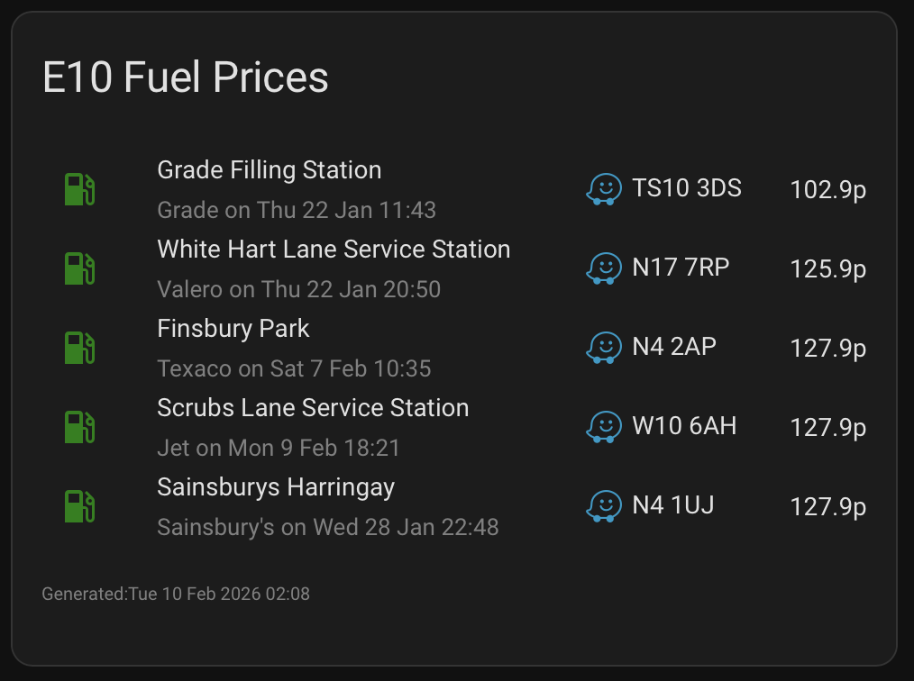

# UK Fuel Finder (`uff.py`)

A command-line tool for querying UK fuel prices from the [Government Fuel Finder API](https://www.fuel-finder.service.gov.uk/) with intelligent caching, multi-sensor support, and flexible filtering.

Built primarily for [Home Assistant](https://www.home-assistant.io/) as a `command_line` sensor, but works equally well as a standalone script outputting JSON to stdout.

Script can be run repeatedly, and in parallel if required.

## Features

- **Smart caching** — baseline + incremental updates minimise API calls; the cache rebuilds itself automatically
- **Multi-sensor safe** — file locking allows concurrent execution from multiple HA sensors without conflicts
- **Fast queries** — after initial cache build, queries complete in under a second
- **Flexible filtering** — regex patterns for station name, brand, postcode, town, and fuel type
- **Data cleaning** — automatically detects and corrects price entry errors (prices reported in pounds instead of pence)
- **All fuel types** — E10, E5, B7 Standard, B7 Premium, HVO, B10

## Prerequisites

- Python 3.7+ (included in Home Assistant's Python environment)
- The `requests` library (included in Home Assistant's Python environment)
- API credentials from the [UK Fuel Finder service](https://www.fuel-finder.service.gov.uk/) — registration is free

## Quick Start (Standalone)

Although this was primarily written for use within a Home Assistant environment
you can run `uff.py` anywhere Python and `requests` are available.
It stores its cache and config in a single working directory.

Detailed instriuctions on installing for Home Assistant are below, but here is a quick
guide to installing for any other environment.

```bash
# Install requests if not already available
pip install requests

# Create a config directory
mkdir -p ~/.config/uk_fuel_finder

# Create a minimal config file with your credentials
cat > ~/.config/uk_fuel_finder/config.json << 'EOF'
{
  "client_id": "YOUR_CLIENT_ID",
  "client_secret": "YOUR_CLIENT_SECRET"
}
EOF

# Run a query (first run will take a few minutes to download all station data)
python3 uff.py \
  --config-dir ~/.config/uk_fuel_finder \
  --lat 51.5074 --lon -0.1278 --radius-miles 5 \
  --sort "cheapest:E10" --limit 5 --debug
```

The `--debug` flag sends diagnostic messages to stderr so you can see the cache building progress. All JSON output goes to stdout, so it is always safe to pipe or parse.

If you have `jq` available you can pipe the output through it to view the json structure anyway you want, just add `| jq` to the end of the command line.

Once the cache is built, subsequent runs will be near-instant. Run it again without `--debug` to see the clean JSON output:

```bash
python3 uff.py \
  --config-dir ~/.config/uk_fuel_finder \
  --lat 51.5074 --lon -0.1278 --radius-miles 5 \
  --sort "cheapest:E10" --limit 5
```

For scheduled use, add it to crontab and redirect the output as needed.

## Home Assistant Installation (Docker)

These instructions are for Home Assistant running as a Docker container. For other installation types the steps should be straightforward to adapt — the key requirements are placing the script and its config inside the `/config` tree.

### 1. Copy the Script

Place `uff.py` into your Home Assistant scripts directory. If you don't already have one, create it:

```bash
mkdir -p /path/to/your/ha/config/scripts
cp uff.py /path/to/your/ha/config/scripts/
```

This will be accessible inside the container as `/config/scripts/uff.py`.

### 2. Create the Config Directory and Credentials

The script stores its cache and reads credentials from a working directory. By default this is `/config/.storage/uk_fuel_finder`.

```bash
mkdir -p /path/to/your/ha/config/.storage/uk_fuel_finder
```

Create a `config.json` file with your API credentials:

```json
{
  "client_id": "YOUR_CLIENT_ID",
  "client_secret": "YOUR_CLIENT_SECRET"
}
```

> **Note:** You can alternatively pass credentials via `--client-id` and `--client-secret` command-line arguments, but storing them in `config.json` is more secure as they won't appear in process listings.

### 3. Test from Inside the Container

Open a shell inside your Home Assistant container:

```bash
docker exec -it homeassistant /bin/bash
```

> Replace `homeassistant` with your container name if it differs from the default.

Run the script manually to build the initial cache:

```bash
python3 /config/scripts/uff.py \
  --lat 51.5074 --lon -0.1278 --radius-miles 10 \
  --sort "cheapest:E10" --limit 5 --debug
```

The first run will take a few minutes as it downloads all station and price data from the API. You will see progress in the debug output. Once complete, run it again to confirm the cache is working — the second run should complete in under a second.

If you have `jq` available inside your docker container (it should be) you can pipe the output through it to view the json structure anyway you want, just add `| jq` to the end of the command line.

### 4. Configure the Command Line Sensor

Add the following to your `/config/configuration.yaml` if you haven't already:

```yaml
command_line: !include command_line.yaml
```

Create (or add to) `/config/command_line.yaml`:

```yaml
# UK Fuel Prices - E10
- sensor:
    name: "Local E10 Prices"
    unique_id: local_e10_prices
    scan_interval: 1800
    command_timeout: 900
    command: >-
      python3 /config/scripts/uff.py
      --lat 51.5074 --lon -0.1278 --radius-miles 10
      --sort "cheapest:E10" --limit 5 --no-best
    value_template: "{{ value_json.state }}"
    icon: "mdi:gas-station"
    json_attributes:
      - generated_at
      - stations
```

Replace the `--lat` and `--lon` values with your location. The `scan_interval` of 1800 seconds (30 minutes) is a reasonable polling frequency — the script's internal cache means the API is only called when data has actually gone stale.

This command will return the cheapest 5 petrol stations, sorted by price (cheapest first), within 10 miles of the specfied co-ordinates - simple to iterate over
and display in a markdown card in a Lovelace dashboard.
You can optionally add a block to the JSON output to show just the cheapest station by removing the `--no-best` option. See below for a 
full list of command line arguments.

You can add multiple sensors for different fuel types or locations. The file locking ensures they won't interfere with each other:

```yaml
# UK Fuel Prices - B7 Diesel
- sensor:
    name: "Local Diesel Prices"
    unique_id: local_diesel_prices
    scan_interval: 1800
    command_timeout: 900
    command: >-
      python3 /config/scripts/uff.py
      --lat 51.5074 --lon -0.1278 --radius-miles 10
      --sort "cheapest:B7_STANDARD" --limit 5 --no-best
    value_template: "{{ value_json.state }}"
    icon: "mdi:gas-station"
    json_attributes:
      - generated_at
      - stations
```

Restart Home Assistant and the sensor(s) will appear.

### 5. Dashboard Card

Here is an example Markdown card for displaying the sensor on a dashboard:



```yaml
type: markdown
title: E10 Fuel Prices
content: >-
  
  
  
    <center>
    <table width="100%">
    
      
      
      
      
      
      
      
      
      
      <tr>
        <td align="center" valign="middle" width="9%">
          <font color="green"><ha-icon icon="mdi:gas-station"></ha-icon></font>
        </td>
        <td width="5%"></td>
        <td>
          {{ name | title }}<br />
          <font size=2 color="grey">
            {{ (brand or 'Set') | title }}{{ ' ' }}
            
              on {{ upd | as_timestamp | timestamp_custom(' %a %-d %b %H:%M', true, 0) }}
            
              NA
            
          </font>
        </td>
        <td>
          
            {%- set link =
              '<a href="https://waze.com/ul?ll=' +
              lat + '%2C' + lon + '&navigate=yes&zoom=17">' +
              '<ha-icon icon="mdi:waze"></ha-icon>' +
              '</a> ' + (pc | upper) -%}
          
            
          
          
            {{ link }}{{ " " }}
          
        </td>
        <td align="right">{{ price }}p</td>
      </tr>
    
    </table>
    </center>
    
    <p><font size=1 color="grey">
      Generated:
      
        {{ gen | as_timestamp | timestamp_custom('%a %-d %b %Y %H:%M', true, 0) }}
      
        NA
      
    </font></p>
  
    <center>No Fuel Prices Available</center>
  
card_mod:
  style:
    ha-markdown $:
      ha-markdown-element: |
        td {
          border: none !important;
          padding: 0px !important;
        }
```

> The `card_mod` section requires [card-mod](https://github.com/thomasloven/lovelace-card-mod) to be installed. It removes the gridlines that Home Assistant's recent updates have added to Markdown tables. Without it, the card will still work but the table styling won't be as clean.

Each row shows the station name, brand, last price update time, a Waze navigation link with the postcode, and the price in pence.

## Command-Line Reference

### Working Directory

| Priority | Source                          | Example                               |
|----------|---------------------------------|---------------------------------------|
| 1        | `--config-dir /path/to/dir`     | `--config-dir /tmp/uff`               |
| 2        | `UFF_CONFIG_DIR` env var        | `export UFF_CONFIG_DIR=/tmp/uff`      |
| 3        | Default                         | `/config/.storage/uk_fuel_finder`     |

### Credentials

| Priority | Source                                  |
|----------|-----------------------------------------|
| 1        | `--client-id` / `--client-secret`       |
| 2        | `config.json` in working directory      |
| 3        | `UFF_CLIENT_ID` / `UFF_CLIENT_SECRET` env vars |

### Options

| Option              | Description                                                   |
|---------------------|---------------------------------------------------------------|
| `--config-dir DIR`  | Working directory for config, cache, and lock files            |
| `--debug`           | Print diagnostic messages to stderr                           |
| `--client-id ID`    | API client ID (overrides config file and env)                 |
| `--client-secret S` | API client secret (overrides config file and env)             |
| `--full-refresh`    | Invalidate the cache and rebuild from scratch                 |
| `--health`          | Output only cache health statistics, then exit                |
| `--no-health`       | Omit cache/health metadata from output                        |
| `--no-stations`     | Omit the stations array from output                           |
| `--no-best`         | Omit the `best_fuel` analysis from output                     |
| `--lat FLOAT`       | Latitude for radius search                                    |
| `--lon FLOAT`       | Longitude for radius search                                   |
| `--radius-km FLOAT` | Search radius in kilometres                                   |
| `--radius-miles FLOAT` | Search radius in miles (converted to km internally)        |
| `--station-id ID`   | Query specific station(s) by ID (repeatable)                  |
| `--re-name REGEX`   | Filter by station name (repeatable, case-insensitive)         |
| `--re-brand REGEX`  | Filter by brand name (repeatable, case-insensitive)           |
| `--re-postcode RE`  | Filter by postcode (repeatable, case-insensitive)             |
| `--re-town REGEX`   | Filter by town/city (repeatable, case-insensitive)            |
| `--re-id REGEX`     | Filter by station ID (repeatable, case-insensitive)           |
| `--re-fuel REGEX`   | Filter by fuel type (repeatable, case-insensitive)            |
| `--sort MODE`       | Sort order: `distance` (default) or `cheapest:<FUEL_TYPE>`    |
| `--limit N`         | Maximum number of results (default: 10)                       |

Regex filters are combined with AND across categories and OR within the same category. For example, `--re-brand "shell" --re-brand "bp" --re-town "london"` matches stations branded either Shell or BP in London.

### Working Directory Files

| File          | Purpose                                           |
|---------------|---------------------------------------------------|
| `config.json` | Optional: API credentials and tuning overrides     |
| `state.json`  | Cache: all station and price data (~3–5 MB)        |
| `token.json`  | OAuth access and refresh tokens                    |
| `state.lock`  | Inter-process lock file (auto-managed)             |

### Cache Timing Defaults

These can be overridden in `config.json`:

| Setting                        | Default | Description                                   |
|--------------------------------|---------|-----------------------------------------------|
| `stations_baseline_days`       | 7       | Days between full station list refreshes       |
| `stations_incremental_hours`   | 12      | Hours between incremental station updates      |
| `prices_baseline_days`         | 2       | Days between full price refreshes              |
| `prices_incremental_hours`     | 1.0     | Hours between incremental price updates        |

## API Documentation

See [uff_api.md](uff_api.md) for the full API specification.

## Licence

This project is licensed under the GNU General Public License v3.0 — see the [LICENCE](LICENCE) file for details.

## Author

Phil Male — [https://phil-male.com](https://phil-male.com)

Created for the Home Assistant community.
